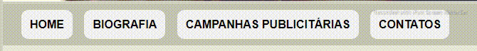
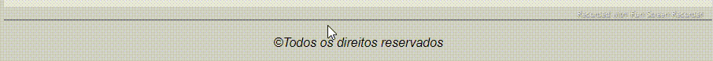
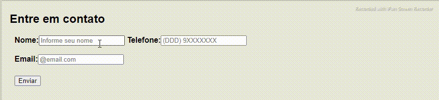
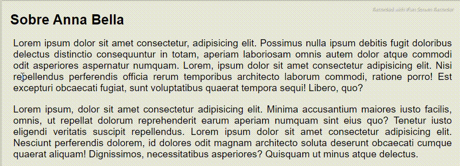
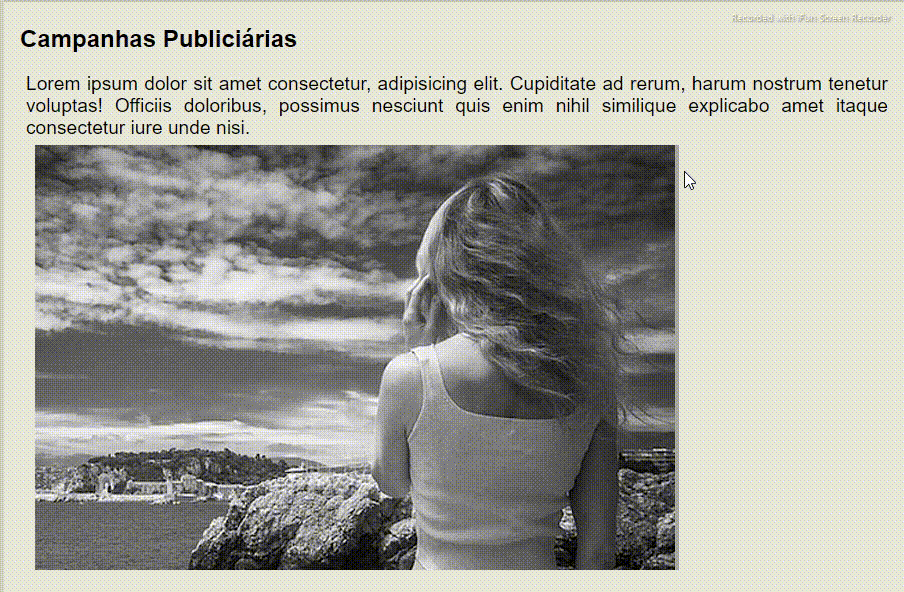

<h1>Projeto site modelo Anna Belle 💻😉</h1>

<a href="https://araujoleonardo310.github.io/projeto-anna-bella/">🔗Clieque aqui!</a>

## Sobre
> Segundo projeto do curso de Web Desenvolvedor 2021, tendo como foque a criação de um site para divulgar ao público o perfil e trabalhos da modelo Anna Bella.

## Status ✌️

### Projeto concluído 🚀

## Recursos & Ferramentas 

* Git 
* Github 
* Visual Studio Code 
* Html 
* CSS

## O quê aprendi 🧑‍💻

* Estilização de página 
* Noções de semânticas 
* Um pouco de versionamento 
* Boas práticas(comentários no código) e conhecimento de novos recursos para desenvolvimento 
* Leitura e pesquisa de documentções
* Desenvolvimento de criatividade

## O que fiz diferente e complementei ao projeto

Veja o projeto original do professor 😄 <a href="https://drive.google.com/file/d/1xShH23ALBsKFKIQ4O5ANDrPx9sE2-o53/view?usp=sharing">🔗Clique aqui!</a>

    

## Apliquei efeitos ao menu de navegação.

 
## Estilizei rodapé com borda superior, formatação e símbolo.

### Implantei formulário para captação de Leeds.

## Coloquei espaço no título e início do texto.

## Adicionei borda lateral nas imagens.

## 🐧🖖 Créditos & 🔗 Refências 

[- Curso de Web desenvolvedor 2021 +20 projetos](https://www.udemy.com/share/101WqG2@Pm1KfUtjSVcKdEFLAHJOVBRuSlc=/)

## Autor do projeto 👊

### Leonardo Araújo  
**Universiário 🧑‍🎓 de Sistemas de Informação 💻**

***"O prazer da vida está em descobrir novas maneiras de ser mais feliz ✨"*** 

